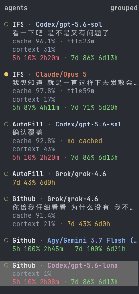
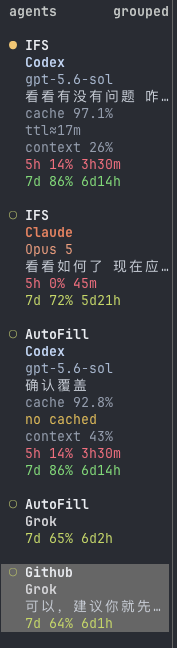
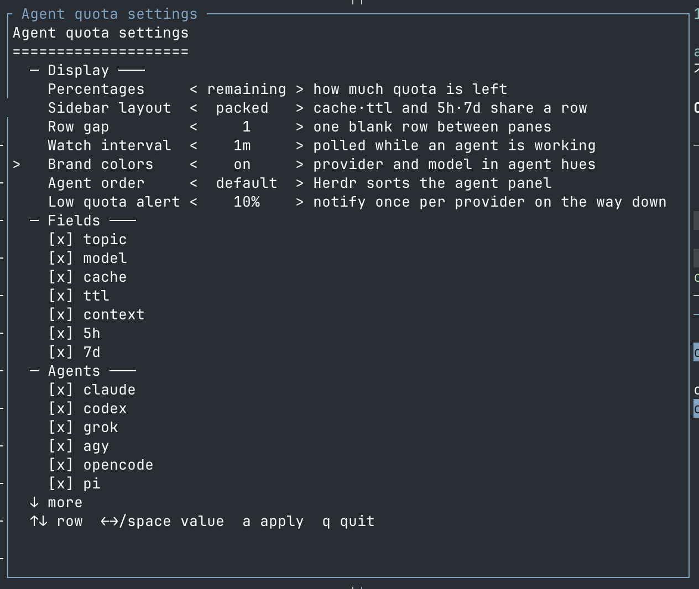

# herdr-agent-quota

在 Herdr Agent 侧栏显示按凭据隔离的模型、上下文、缓存和订阅额度。

[](https://github.com/levi-qiao/herdr-agent-quota/actions/workflows/ci.yml)
[](https://www.rust-lang.org/)
[](LICENSE)

English: [README.md](README.md)

<table>
<tr><th>packed（默认）</th><th>stacked</th></tr>
<tr>
<td valign="top"></td>
<td valign="top"></td>
</tr>
</table>

空字段自动折叠。刷新失败时保留同一账户最后一次成功结果；确认是 PAYG 的 session 会清掉旧订阅额度。

## 安装

要求：Herdr 0.8.0+、Rust 1.95+、macOS 或 Linux，以及至少一个受支持的 agent CLI。

```sh
git clone https://github.com/levi-qiao/herdr-agent-quota.git
cd herdr-agent-quota
./install.sh
```

安装后重启已经运行的 agent pane。只启用部分 agent：

```sh
./install.sh --agent claude,codex,omp
```

`install.sh` 只会在共享的 `ui.sidebar.agents.rows` 为空、已由本插件管理、或等于
Herdr 默认的 `["state_icon", "agent"]` 时改写它。其他插件或用户自己的行会保留，
仍会为所选 agent 添加或更新 `rows_by_agent`。

可选值：`all`、`claude`、`codex`、`grok`、`agy`、`opencode`、`pi`、`omp`、`devin`。

## 设置

按 `prefix+shift+q` 打开。也可以直接运行：

```sh
herdr plugin pane open --plugin herdr-agent-quota --entrypoint settings --focus
```

Herdr 0.8 的原生 Settings tab 和右下角 `menu` 不提供插件扩展点，因此插件
无法把自己的设置页插进截图中的内置面板；快捷键冲突时不会覆盖用户配置，
仍可使用上面的命令。



| 设置 | 可选值 | 作用 |
| --- | --- | --- |
| Percentages | `remaining`、`used` | 显示剩余或已用比例；颜色始终表示剩余额度。 |
| Sidebar layout | `packed`、`stacked` | 相关字段同行显示，或每项独占一行。 |
| Row gap | `0`、`1` | 控制 Agent 卡片之间的空行。 |
| Watch interval | 30 秒–1 小时 | Agent 工作期间的刷新间隔。 |
| Brand colors | `on`、`off` | 控制供应商/模型品牌色；额度告警色不受影响。 |
| Agent order | `default`、`quota` | 可把剩余额度最少的 Agent 排在最上面。 |
| Low quota alert | `off`、5–50% | 首次跌破阈值时按供应商提醒一次。 |
| Fields | topic、model、cache、TTL、context、短/长额度 | 控制可选侧栏维度。 |
| Agents | 八个受支持 harness | 安装或移除 collector 和对应侧栏行。 |

`↑/↓` 移动，`←/→` 或空格修改，`a` 应用，`q` 退出。`*` 表示修改尚未应用。

同样的配置也可以脚本化：

```sh
./install.sh \
  --agent all \
  --sidebar-layout packed \
  --row-gap 1 \
  --quota-percent remaining \
  --fields all \
  --brand-colors on \
  --agent-order quota \
  --low-quota-alert 10 \
  --watch-interval-seconds 60
```

手动刷新和卸载：

```sh
herdr plugin action invoke refresh --plugin herdr-agent-quota
./uninstall.sh
```

## 展示维度

| 维度 | 来源与行为 |
| --- | --- |
| 供应商 / 模型 | 当前 pane 精确 session 的路由和模型。Devin 在有 CLI 当前配置模型时使用它，否则回退到额度 API 的 `planInfo.planName`。只有拿到 session 级证据时才按 session 归属模型。 |
| Topic | 当前可见的用户问题；滚出屏幕后保留已发布主题。 |
| Context | 当前模型上下文窗口的已用比例。 |
| Cache | 上游提供可信计数时显示 session 缓存命中率。 |
| Cache TTL | 优先显示上游记录的过期时间；`ttl≈` 表示有文档依据的估算。 |
| Quota | 当前服务账户的剩余/已用比例和重置倒计时。 |
| Headroom | 可见窗口中最紧的额度，用于可选排序和提醒。 |

| Agent | 额度支持 | Session 信息 |
| --- | --- | --- |
| Claude Code | 5h + 7d | model、context、cache、记录的 prompt-cache 过期时间 |
| OpenAI Codex | 5h + 7d | model、context、cache、估算的 30 分钟 cache TTL、摘要 |
| Grok CLI | 7d 或 30d | model、context、cache |
| Agy / Antigravity | 5h + 7d | statusLine 提供的 model、context、cache |
| OpenCode | OpenCode Go 5h + 7d；dashboard 含 30d | 精确本地 session 的 model/context |
| Pi | 只有账户精确匹配时复用规范 Codex 额度 | model、context、cache、可支持的 TTL |
| omp（oh-my-pi） | 原样展示 `omp usage` 归一化窗口，如 `5h`、`1d`、`7d`、`Monthly` | model、context、cache、可支持的 TTL |
| Devin CLI | 1d + 7d | CLI 配置的默认模型来自 `~/.config/devin/config.json` 的 `agent.model`，若本地有 `devin-models.json` 则映射为显示名。这不是 session 模型，也不会使用 API 的 `planName`。 |

OMP 是通用适配，不为内部每个供应商维护第二套规则。插件只调用
`omp usage --json --provider <id>`，保留 OMP 给出的窗口标签，再用 session 的
`credential_pin` 归属账户；不会打开 OMP 凭据数据库，也不会重新解释 Google、Anthropic、
OpenAI 的周期。OMP 自己有五分钟 usage 缓存，本插件额外限制同一 provider 每分钟最多启动一次进程。

侧栏有短、长两个额度位置。OMP 的常用窗口进入这两行，标签保持 OMP 原值，每行显示一个
归一化窗口。

## Herdr integration

Herdr 必须先上报精确 session，插件才能归属本地模型、上下文和账户：

```sh
herdr integration status
```

启用 OMP 时，如果 Herdr 明确报告缺少 integration，插件会自动执行
`herdr integration install omp`。已经运行的 OMP pane 仍需重启一次，因为 integration
只在 agent 启动时加载。其他缺失项可手动修复：

```sh
herdr integration install opencode
herdr integration install pi
herdr integration install omp
herdr integration install devin
```

## 常见问题

| 现象 | 检查 |
| --- | --- |
| OpenCode、Pi、OMP 或 Devin 全空 | 运行 `herdr integration status`，安装缺失项并重启对应 pane。 |
| Devin 没有额度 | 确认 `~/.local/share/devin/credentials.toml`（或 `$DEVIN_CREDENTIALS_FILE`）含有 `windsurf_api_key`。 |
| OMP 有 model/context 但无额度 | 运行 `omp usage --json --redact --provider <id>`，确认当前 provider 有 report。 |
| Herdr 无法执行 OMP | 把 `omp` 放进 server 的 `PATH`，或设置 `HERDR_AGENT_QUOTA_OMP_BIN`。 |
| Claude 或 Agy 显示 `N/A` | 发送一轮消息，让 statusLine 产生 snapshot。 |
| 侧栏行没出现 | 运行 `herdr plugin action invoke configure --plugin herdr-agent-quota`，再重启相关 pane。 |
| 供应商故障后仍保留旧值 | 这是预期行为：同一账户保留最后一次成功 snapshot。 |
| packed 内容被截断 | 切换到 `stacked`；Herdr 不会自动换行。 |

## 安全边界

- 不发送 prompt，也不发起模型请求。
- event 只用 `--source visible` 读取点名的 pane；refresh 和 watcher 不读 pane。
- 凭据留在对应 CLI；snapshot 只存脱敏用量和哈希账户归属。
- 永远不打开 OMP 的 `agent.db`；额度只来自 OMP CLI 输出。
- Devin 额度走 CLI 自己的 `GetUserStatus` 合同；API key 只用于哈希账户身份，不会写入 snapshot。
- token 真正变化时才写 metadata，并遵守 Herdr 16-token 上限。

## 开发检查

```sh
cargo fmt --all -- --check
cargo test --all-targets --all-features --locked
cargo clippy --release --all-targets --all-features --locked -- -D warnings
cargo build --release --locked
```

更多信息见 [CONTRIBUTING.md](CONTRIBUTING.md)、[SECURITY.md](SECURITY.md) 和
[CHANGELOG.md](CHANGELOG.md)。

## 许可证

MIT。本项目与 Herdr、OpenAI、Anthropic、xAI、Google、OpenCode 或 Cognition 无隶属关系。
