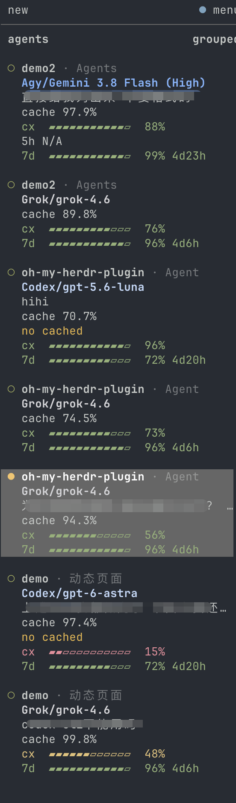

# herdr-agent-usage

在 Herdr Agent 侧栏显示模型、上下文和订阅额度——按 Space 分组，并用品牌图标承载
agent 状态。

[](https://github.com/levi-qiao/herdr-agent-usage/actions/workflows/ci.yml)
[](LICENSE)

[English](README.md)



Agent 按所属 Space 分组。每一行只用本插件的品牌图标，不再画 Herdr 原生状态圈；
图标颜色跟随 agent——工作中为黄、完成后为青绿；聚焦该 pane，或焦点从它移走后变为墨白。其他未读的绿色 pane 不受影响。
Provider／模型保持墨白色；进度条上的严重程度色仍表示剩余额度。

默认布局是 `gauges`：在每个额度数字旁加一条进度条。进度条长度始终对应旁边打印的数字；
`cx`、`5h`、`7d`、`30d` 都跟随 `quota-percent`。标签列三个字符，内置周期对齐；
服务商自定义的窗口名过长时退回普通数字行，而不是截断进度条。进度条按当前连接的
Herdr endpoint 侧栏宽度定长（已计入缩进和滚动条）。空字段自动折叠，百分比可选择
显示剩余或已用额度。Cache 与 TTL 默认关闭（需要时可在设置里打开）。Grok、Codex、
Devin、OpenCode、Cursor 在同一个 Space 里每个标签页都还在 Agent 列表里，只把重复
的 5h/7d/30d 收到一行上；宽栏下主行只留图标、厂商名和额度，子行无图标，
只显示 model、topic、cx。设置里的 1 行空格仍隔开不同 agent；同一厂商的嵌套子行贴在一起。窄栏仍平铺。
另一个 Space 里的同厂商仍有自己的额度行。Claude 和 Agy 仍按窗格各自显示。Agent
order 默认按 Space 分组，组内剩余额度最少的优先。
低额度通知默认关闭，直到你设置阈值。
布局、字段和百分比口径都可以在设置面板里改（`prefix+shift+q`）。

## 安装与升级

要求：**Herdr 0.9.0+**、`rust-toolchain.toml` 指定的 Rust 工具链、macOS 或 Linux，
以及受支持的 agent CLI。

```sh
git clone https://github.com/levi-qiao/herdr-agent-usage.git
cd herdr-agent-usage
./install.sh
```

GitHub 仓库名和 Herdr 插件 id 都是 `herdr-agent-usage`。`./install.sh` 会接管已有的
`herdr-agent-quota` 配置和状态，即使 Herdr 已经把链接换成新 id 也会从磁盘上的旧目录
搬过去，然后再 unlink 仍在列表里的旧 id。新二进制第一次启动时也会搬 Herdr 注入的那两个
目录。拉取之后请再跑一次 `./install.sh`，Cursor 的 hook 命令才会改写；在那之前旧脚本
继续生效。

只启用部分 agent：`./install.sh --agent claude,codex,omp`。
仅在需要加载新安装的 hook 或 Herdr integration 时，才需重启已经运行的 agent 会话。

脚本会编译、链接并跑 `configure`。它不会在每一种终端里把图标映射好，也不会
做完 Herdr integration 和 macOS 钥匙串授权。要让这台电脑上的编程助手收尾，
把 [让 Agent 装完整](#让-agent-装完整) 里的提示词贴给它。

在仓库目录升级：

```sh
git pull --ff-only
./install.sh
```

升级保留已有偏好，修复插件管理的配置，重新读取额度并自动恢复后台更新。
不需要删除缓存或管理 watcher 进程；Herdr 服务端连接变化后，watcher 会自动接管。

## 让 Agent 装完整

`./install.sh` 不是全部工作：品牌图标要在**当前**终端里映射字体，多数 agent
还要 Herdr integration，macOS 上的 Cursor/Muse 需要一次性钥匙串 **Always
Allow**。把下面这段贴给**跑 Herdr 的这台电脑**上的 Claude、Cursor、Grok、
Codex 或其他编程助手。完整步骤和命令见
[docs/agent-setup.zh-CN.md](docs/agent-setup.zh-CN.md)
（[English](docs/agent-setup.md)）。

```
把 herdr-agent-usage 在这台电脑上配置到真正能用：Herdr 的 Agent 侧栏要显示
品牌图标，以及我实际安装了的那些 agent CLI 的额度。不要在 ./install.sh
结束后停手。图标变成方框或问号都算没装完。

仓库：https://github.com/levi-qiao/herdr-agent-usage
若当前工作区已经是该仓库就直接用；否则 clone 后进入目录，严格按照
docs/agent-setup.zh-CN.md（中文）或 docs/agent-setup.md（英文）执行。
读不到这两个文件时，仍须做完下面全部步骤。

规则：
- 不要 herdr pane read（尤其 --source recent）。那会重绘正在跑的 agent TUI。
- 不要调用名为 agent 的裸命令（和 Grok 并存时那是 Grok 的）。Cursor CLI 是
  cursor 或 cursor-agent。
- 不要给 Cursor 装 statusLine，那会换掉官方底栏。
- 插件 action 看不到你 export 的环境变量。选择项用 ./install.sh 的 flag 传。
- 用 rustup 装 rust-toolchain.toml 里的工具链，不要 brew install rust。

1. PATH 先加上 ~/.local/bin、~/.cargo/bin、/opt/homebrew/bin、/usr/local/bin。
   需要 herdr 0.9.0+ 和 rustup/cargo。没有 herdr 就停下来告诉我。没有 cargo
   就装 rustup（https://rustup.rs），不要用发行版/Homebrew 的 rust 包。

2. 探测 agent：PATH 上的二进制、常见配置目录、以及 herdr agent list 的并集。
   --agent 名字：claude（claude，~/.claude）、codex（codex，~/.codex）、
   grok（grok，~/.grok）、agy（agy，~/.gemini/antigravity-cli）、
   opencode（opencode，~/.config/opencode）、pi（pi，~/.pi/agent）、
   omp（omp，~/.omp）、devin（devin，~/.local/share/devin）、
   muse（muse 或 muse-code，~/.config/muse）、
   cursor（cursor 或 cursor-agent，~/.cursor）。
   先打印探测结果。一个都没有就装 all，并说明。

3. 在仓库里：若是干净的 main 先 git pull --ff-only，然后
   ./install.sh --agent <探测到的,逗号分隔>
   读完输出。font: 和缺失 integration 都是还没做完的工作。

4. 脚本之后：
   - herdr plugin list 必须能看到已启用的 herdr-agent-usage。
   - 等到 configure/refresh 日志 succeeded（invoke 会在 running 时就返回）。
   - herdr integration status；已探测到且为 not installed 的，执行
     herdr integration install <id>（claude、codex、grok、opencode、pi、omp、
     devin、cursor；agy 和 muse 不需要）。用户没有的 CLI 不要装。
   - 字体：configure 会把 Herdr Agent Icons Max 拷到 ~/Library/Fonts（macOS）
     或 ~/.local/share/fonts（Linux），且仅当 Ghostty/kitty 配置已存在时写入
     映射。Linux 对该字体目录跑 fc-cache。判断当前终端（TERM_PROGRAM /
     KITTY_WINDOW_ID / WEZTERM_EXECUTABLE）。PUA U+E1A0–U+E1B6 必须显式映射，
     否则格子是方框或「?」。Ghostty：
     font-codepoint-map = U+E1A0-U+E1B6="Herdr Agent Icons Max"
     （以及 U+E1C0–U+E1C5），包在 # BEGIN/END herdr-agent-usage font 里。
     kitty：symbol_map 同样范围到 Herdr Agent Icons Max。WezTerm：把该 family
     加进 font_with_fallback。VS Code/Cursor：追加到
     terminal.integrated.fontFamily。然后重载终端（Ghostty cmd+shift+,，
     kitty ctrl+shift+f5）。Muse 故意用文本标记 ◈。宽栏里同一厂商的嵌套子行
     本来就没有图标。1.6.1 之后仍是黄色「?」多半是终端没映射；更旧版本工作态
     用了 ZWNJ，需要升级。
   - macOS 上的 Cursor：若 ~/.cursor/cli-config.json 有 authInfo，且没有
     ~/.cursor/.herdr-keychain-approved，先告诉我，再运行
     ./target/release/herdr-agent-usage refresh --provider cursor --keychain-approve --force
     并让我点 Always Allow（不要点 Allow）。
   - macOS 上 Muse 的 keychain 登录：同样用 --provider muse。
   - herdr plugin action invoke refresh --plugin herdr-agent-usage 并等待结束。
   - 告诉我哪些已经在跑的窗格要重启（新 hook / integration）。Claude/Agy 要
     再发一轮 StatusLine 才会有额度。Cursor 的 cache 要在 hooks.json 重载后
     再发一轮。

5. 汇报：探测到 vs 实际启用的 agent、integration、字体路径和映射了哪个终端、
   钥匙串、还要重启什么、还有什么是坏的。没有人看过图标或未经字体映射验证时，
   不要声称图标已经正确。
```

## 设置

按 `prefix+shift+q` 打开；若该快捷键已有其他用途，可运行：

```sh
herdr plugin pane open --plugin herdr-agent-usage --entrypoint settings --focus
```


| 设置 | 可选项 |
| --- | --- |
| Percentages | 剩余或已用比例；颜色始终表示剩余额度 |
| Sidebar pacing | 关闭（默认）保留额度百分比和进度条；开启后在 5h/7d 行显示节奏 |
| StatusLine pace | 开启（默认）保留现有的额度节奏输出；关闭后不改 Claude 自己的 statusLine 输出 |
| Layout | `gauges`（默认）在每个额度数字旁加进度条；`packed` 合并相关字段；`stacked` 将字段分行显示 |
| Row gap | Agent 之间保留零行或一行空白 |
| Watch interval | 30 秒–1 小时，默认 60 秒 |
| Fields | 默认开启提供方、主题、模型、上下文、短期／长期／月度额度；cache 与 TTL 可选 |
| Agent order | 按 Space 分组，组内剩余额度最少优先（默认）；或使用 Herdr 自己的排序 |
| Low quota alert | 关闭，或设置 1%–100% 的提醒阈值 |
| Agents | Claude、Codex、Grok、Agy、OpenCode、Pi、OMP、Devin、Muse、Cursor |

方向键或空格修改，`a` 应用，`q` 关闭。脚本配置选项见 `./install.sh --help`。
Claude 状态栏节奏是独立开关，默认开启以保持升级前行为；可用 `./install.sh --statusline-pace off` 关闭，关闭时仍会正常采集额度观测并供侧栏使用。

## 数据来源与边界

| Agent | 额度来源 | 归属依据 |
| --- | --- | --- |
| Codex | Codex app-server；5h 和／或 7d | 插件 `CODEX_HOME` 中的当前登录 |
| Grok | CLI billing 接口；7d 或 30d | 当前 CLI 凭据 |
| Devin | CLI usage 接口；1d 和 7d | 当前 CLI 凭据 |
| Muse Code | CLI 订阅接口；5h 和 7d | 当前 CLI 账号登录；会话通过 Muse 的 session lock 识别（Linux） |
| Cursor | CLI DashboardService usage；at、api 和 30d | 当前 CLI `auth.json`，否则 macOS Keychain 里 `cursor-agent login` 的登录，否则在 CLI 没有自己的登录且设置了 `$CURSOR_STATE_DB` 时用桌面端 `state.vscdb` 的 access token；模型和主题来自本地会话文件；`cx` 来自 `store.db` `token_details`（CLI 底栏百分比）；cache 来自 CLI hook |
| Claude Code | StatusLine；5h 和 7d | 精确会话的观测 |
| Agy / Antigravity | StatusLine；5h、7d，以及 Gemini 会话上的 api（第三方池） | 精确会话与可确认的模型额度池 |
| OpenCode | OpenCode Go usage 接口 | Go 凭据；确认的 PAYG 路由不显示订阅额度 |
| Pi | 规范 Codex collector 的额度 | 仅在记录的账号一致时复用 |
| OMP | `omp usage --json --provider <id>` | usage 账号与会话 credential pin 一致 |

Claude Code 状态栏始终保留用户自己的 statusLine 输出。**StatusLine pace** 默认开启以保持现有行为；
关闭后不再追加节奏。开启时会在末尾追加当前生效额度窗口的消耗节奏，例如 `⏱ 5h ↓12%`：
已用额度减去窗口已过去的时间比例，单位为百分点。
`↓` 表示应放慢，`↑` 表示还有余量，`=` 表示相差五个点以内。以剩余额度最少的窗口为
准并标明窗口（`5h`/`7d`）；该窗口无法计算节奏时不显示，也不改用较宽松的窗口：
没有重置时间、窗口已过期、重置时间距离现在超过窗口长度，或窗口刚开始的前 5%。

额度窗口保留上游定义。模型、上下文和缓存数据优先来自已识别的会话。
`ttl≈` 表示估算的提示词缓存寿命，不保证实际过期时间。
主题提取只读取事件点名窗格的可见屏幕；内容滚走后保留已有主题。Cursor 和 Grok
使用本地会话元数据里的生成标题；Muse 使用 transcript 中的最后一条提示。

所有受支持的工作中 agent 共用一个后台 watcher，请求间隔至少 60 秒，并在回合结束后
完成收尾刷新。OMP 另有自身的五分钟 usage 缓存。共享已确认额度来源的闲置窗格会收到同一读数。

原生 Codex、Grok、Devin、Muse、Cursor collector 跟随插件的当前登录，不为每个窗格分别识别账号。
Claude/Agy 没有可靠的服务账号 ID，因此不跨会话共享观测值。
账号或模型额度池无法确认时不猜测数字。请求失败保留同一账号最后一次已确认的读数，
不会把失败解释为零用量。

## 常见问题

| 现象 | 检查 |
| --- | --- |
| 品牌图标是方框或 `?` | 字体没装上，或当前终端没有 U+E1A0–U+E1B6 映射——见 [让 Agent 装完整](#让-agent-装完整)。`configure` 之后要重载终端。1.6.1 之前工作态的黄色 `?` 是 ZWNJ 的 bug，先升级。Muse 故意用文本标记 `◈`。宽栏里同一厂商的嵌套子行本来就没有图标。 |
| 缺少会话数据 | 运行 `herdr integration status`，安装缺失项后重启对应 agent |
| Claude/Agy 缺少额度 | 发送一轮消息，让该会话的 StatusLine 产生观测 |
| OMP 缺少额度 | 检查 `omp usage --json --redact --provider <id>` |
| Devin 缺少额度 | 检查 CLI 登录；使用自定义路径时检查 `DEVIN_CREDENTIALS_FILE` |
| Muse 缺少额度 | 运行 `muse login`（API key 登录没有订阅额度）；使用自定义路径时检查 `MUSE_AUTH_PATH`。macOS 上 `storage: "keychain"` 登录还需一次性 Keychain 授权：运行 `herdr-agent-usage refresh --provider muse --keychain-approve`，并点击 **Always Allow** |
| Cursor 缺少额度或仍显示上一账号 | 运行 `cursor login`。macOS 上 `cursor-agent login` 把 token 存在 Keychain：运行 `herdr-agent-usage refresh --provider cursor --keychain-approve` 并点击 **Always Allow**。仅当 CLI 本身没有登录且设置了 `$CURSOR_STATE_DB` 时才使用桌面端 token |
| 用 Cursor 时 Ghostty 反复弹出 “would like to access data from other apps” | 这是 macOS 的 `SystemPolicyAppData`：Ghostty 的子进程碰到了 Cursor 名下的文件（`~/.cursor` 或 Application Support）。本插件在 macOS 上默认不再打开这些目录，除非设置了 `$CURSOR_HOME` / `$CURSOR_AUTH_FILE` / `$CURSOR_STATE_DB`。Cursor CLI 自己仍可能弹（它会写 `~/Library/Caches`）。点 **Allow**，或给 Ghostty 开 Files & Folders / Full Disk Access。点 **Don't Allow** 之后读会失败关闭。升级后请重载插件，让 watcher 用上新二进制。 |
| Cursor 缺少 cache/cx | `cx` 来自该会话的 `store.db`；cache 仍需重启 pane 以加载 `hooks.json` 后再发一轮（headless `--print` 不会触发这些 hook） |
| 缺少侧栏行 | 运行下面的 configure action 修复插件配置 |
| 侧栏太窄，`gauges` 不显示进度条 | 约 24 列以下是预期行为；调宽后刷新即可 |
| 调整宽度后 `gauges` 仍是旧长度 | 用 `prefix+shift+r` 刷新；没有随拖动实时发布的路径 |
| `gauges` 下 cache 信息仍分两行 | 调宽侧栏，直到合并后的整行放得下 |

```sh
herdr plugin action invoke refresh --plugin herdr-agent-usage
herdr plugin action invoke configure --plugin herdr-agent-usage
```

完整卸载使用 `./uninstall.sh`，只移除部分 agent 使用 `./uninstall.sh --agent grok`。
配置修改可恢复，用户自己的设置与其他 agent 不受影响。

## 参与开发

开发与验证见 [CONTRIBUTING.md](CONTRIBUTING.md)，数据处理及漏洞报告见
[SECURITY.md](SECURITY.md)，版本变更见 [CHANGELOG.md](CHANGELOG.md)。
历史调研索引见 [docs/README.md](docs/README.md)。

## 许可证

[MIT](LICENSE)。本项目与 Herdr 及受支持的 AI 供应商无隶属关系。
